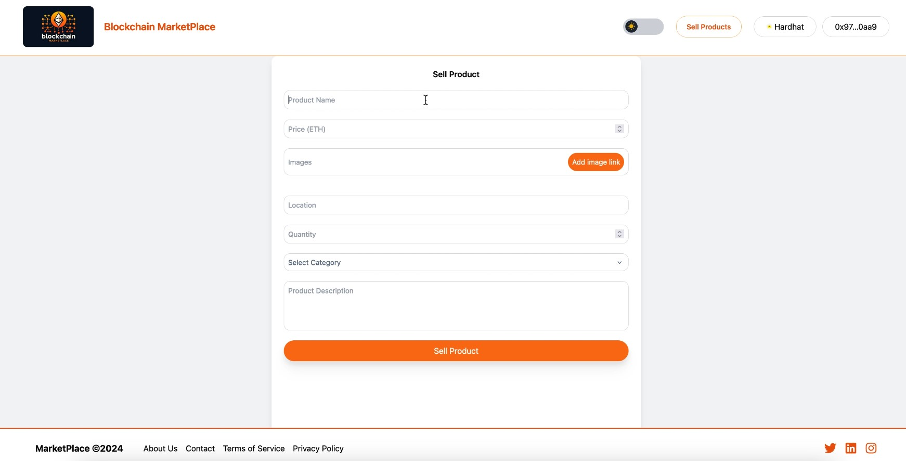
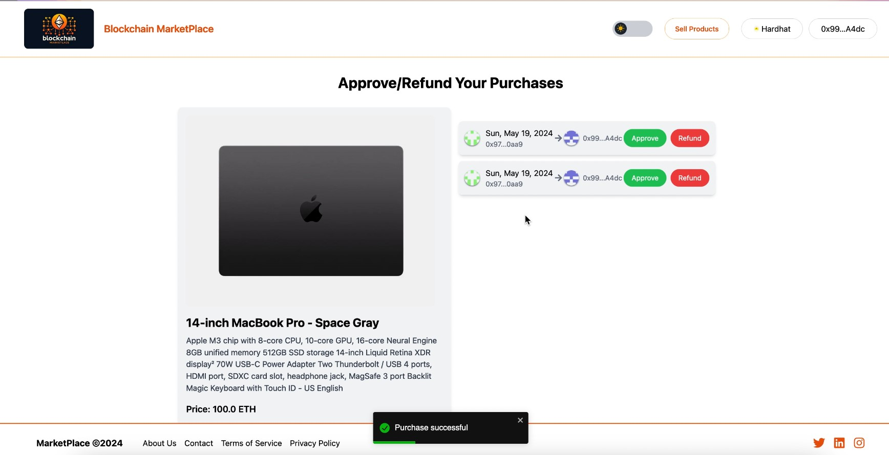

# Dapp-Marketplace

This application is a marketplace that allows users who log in with MetaMask to become either sellers or buyers. Buyers can approve the product in the purchase process using the 'approve' function, or cancel it using the 'refund' function. Buyers can also add reviews to the purchased product.

  
  
  
  
  

  
  
  
### Run the project

**follow this steps:**

 1. open terminal in project directory  
 2. write 'Set-ExecutionPolicy -Scope Process -ExecutionPolicy Bypass' command (for Windows Users)  
 3. yarn install  
 4. yarn blockchain  
   
**_open new terminal window_**  
 1. write again 'Set-ExecutionPolicy -Scope Process -ExecutionPolicy Bypass'  
 2. yarn deploy  
 3. yarn seed  
 4. yarn dev  
  
**alternative (If you do not want to open the project in developer mode, you can apply these alternative commands)**  
  
 1. you can use after 'yarn deploy' command  
 2. yarn build  
 3. yarn start  